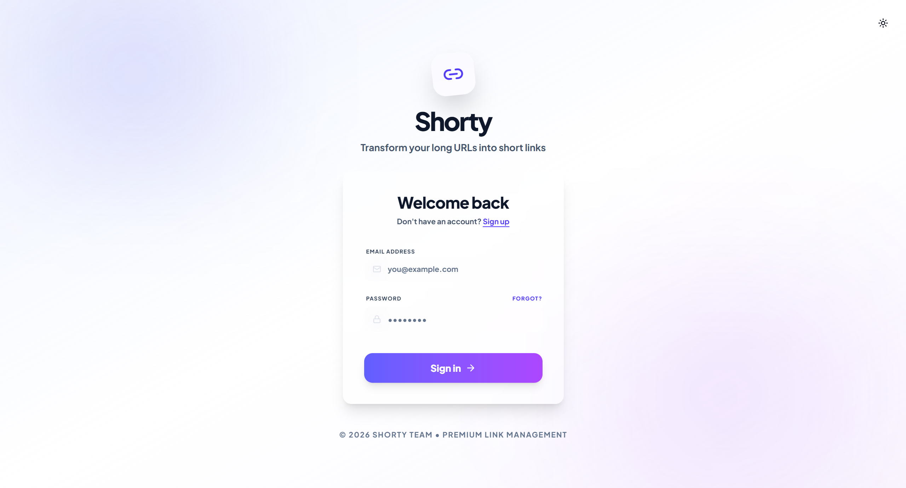
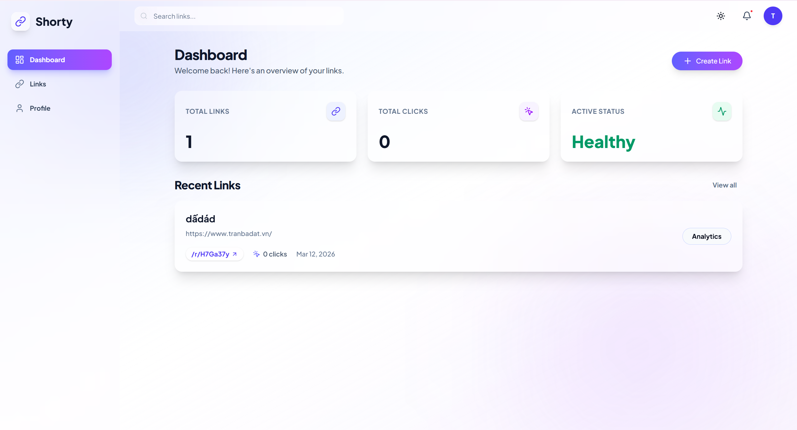
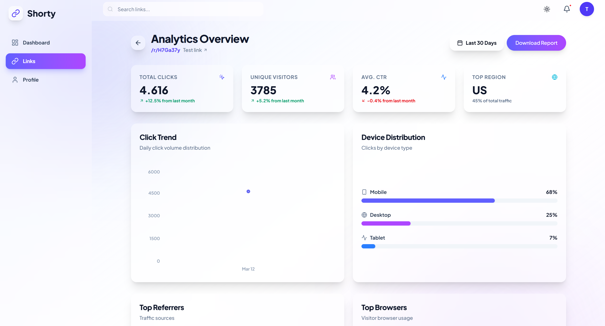

<h1 align="center">URL Shortener</h1>

<p align="center">
  A highly scalable, modern, and production-ready URL shortener platform. Built with a <strong>Spring Boot</strong> backend following Clean Architecture principles and a sleek <strong>React + Vite</strong> frontend.
</p>

> **Credits:**
> - **Backend (`/Backend`)**: Crafted by **Tuan Anh Pham**
> - **Frontend (`/Frontend`)**: Designed & Developed by **Gemini 3.1**

## 📸 Screenshots

<div align="center">
  
    
  
</div>

---

## 🌟 Key Features

*   **Custom Short Links:** Generate random short codes or specify your own custom aliases.
*   **Link Expiration:** Set expiration dates for links to automatically disable them.
*   **Click Analytics:** Track daily clicks, device types, browsers, and referrers for every link.
*   **User Authentication:** Secure JWT-based authentication system with user profiles.
*   **Fast Redirection:** Optimized redirection logic integrated with Bloom Filters for rapid "not found" checks.
*   **Modern UI/UX:** Responsive, glassmorphism-inspired interface built with TailwindCSS and shadcn/ui.
*   **Rate Limiting:** Protects the API and redirection endpoints from abuse (using Bucket4j).

---

## 🏗️ Architecture

The project is structured into two main decoupled applications:

### 1. Backend (`/Backend`)
*   **Framework:** Java 21 & Spring Boot 3.x
*   **Design Pattern:** Clean Architecture (Domain, Application, Presentation, Infrastructure layers)
*   **Database:** PostgreSQL (with Spring Data JPA)
*   **Caching & Optimization:** Bloom Filters (used to quickly filter out invalid short codes before hitting the DB)
*   **Event-Driven:** Uses Spring Application Events (and Kafka conceptually) to handle click tracking asynchronously without blocking redirection.
*   **Security:** Spring Security with JWT (JSON Web Tokens).

### 2. Frontend (`/Frontend`)
*   **Framework:** React 18, Vite
*   **Styling:** TailwindCSS, Radix UI (shadcn/ui components)
*   **State & API Management:** TanStack Query (React Query) for caching and server state synchronization, Axios for HTTP requests.
*   **Form Validation:** React Hook Form + Zod.
*   **Routing:** React Router DOM.

---

## 🚀 Getting Started

Follow these instructions to get a copy of the project up and running on your local machine.

### Prerequisites

Ensure you have the following installed:
*   [Java 21](https://adoptium.net/) or higher
*   [Node.js](https://nodejs.org/) (v18 or higher)
*   [Maven](https://maven.apache.org/) (or use the provided `./mvnw` wrapper)
*   A relational database (PostgreSQL/MySQL) or use an in-memory DB like H2 for local testing.

### ⚙️ Backend Setup

#### Option 1: Using Docker Compose (Recommended)

The easiest way to run the backend and its dependencies (PostgreSQL) is using Docker Compose.

1.  Navigate into the backend directory:
    ```bash
    cd Backend
    ```

2.  Create a `docker-compose.yml` file in the root of the backend folder:
    ```yaml
    version: '3.8'

    services:
      db:
        image: postgres:16-alpine
        container_name: urlshortener-db
        environment:
          POSTGRES_DB: shortener_db
          POSTGRES_USER: postgres
          POSTGRES_PASSWORD: root
        ports:
          - "5432:5432"
        volumes:
          - postgres_data:/var/lib/postgresql/data
        restart: unless-stopped

      api:
        build: .
        container_name: urlshortener-api
        ports:
          - "8080:8080"
        environment:
          - SPRING_DATASOURCE_URL=jdbc:postgresql://db:5432/shortener_db
          - SPRING_DATASOURCE_USERNAME=postgres
          - SPRING_DATASOURCE_PASSWORD=root
        depends_on:
          - db
        restart: unless-stopped

    volumes:
      postgres_data:
    ```

3.  Start the services in detached mode:
    ```bash
    docker-compose up -d
    ```

#### Option 2: Running Locally without Docker

1.  Ensure you have a local PostgreSQL instance running.

2.  Configure your database connection in `src/main/resources/application.yml` (or `application.properties`):
    ```yaml
    spring:
      datasource:
        url: jdbc:postgresql://localhost:5432/shortener_db
        username: postgres
        password: root
      jpa:
        hibernate:
          ddl-auto: update
    ```

3.  Navigate into the backend directory and run the application using Maven:
    ```bash
    cd Backend
    ./mvnw spring-boot:run
    ```

**After starting the backend (via Docker or locally):**
*   **API Base URL:** `http://localhost:8080/api/v1`
*   **Swagger UI Docs:** `http://localhost:8080/swagger-ui.html`

### 💻 Frontend Setup

1.  Open a new terminal and navigate into the frontend directory:
    ```bash
    cd Frontend
    ```

2.  Install all required npm packages:
    ```bash
    npm install
    ```

3.  Start the Vite development server:
    ```bash
    npm run dev
    ```

    The frontend will be available at `http://localhost:3000`.

---

## 🛣️ API Endpoints (Quick Overview)

| Method | Endpoint | Description | Auth Required |
| :--- | :--- | :--- | :---: |
| `POST` | `/api/v1/auth/register` | Register a new user | ❌ |
| `POST` | `/api/v1/auth/login` | Login and get JWT token | ❌ |
| `GET`  | `/api/v1/users/me` | Run current user profile | ✅ |
| `POST` | `/api/v1/links` | Create a new short link | ✅ |
| `GET`  | `/api/v1/links` | List all links for current user | ✅ |
| `GET`  | `/api/v1/links/{id}` | Get details of a specific link | ✅ |
| `PATCH`| `/api/v1/links/{id}` | Update link (title, status) | ✅ |
| `DELETE`| `/api/v1/links/{id}`| Delete a link | ✅ |
| `GET`  | `/api/v1/links/{code}/analytics`| Get analytics for a link | ✅ |
| `GET`  | `/r/{shortCode}` | Redirection endpoint | ❌ |

---

## 🎨 Design System (Frontend)

The UI uses a **Glassmorphism** theme, utilizing semi-transparent backgrounds with backdrop blur.

*   **Colors:** Deep Indigo and Slate primary palettes.
*   **Components:** Built on top of Radix UI primitives ensuring full accessibility (a11y) while maintaining highly custom styling via Tailwind.
*   **Animations:** Smooth page transitions and micro-interactions powered by Framer Motion.

---

## 🤝 Contributing

1. Fork the Project
2. Create your Feature Branch (`git checkout -b feature/AmazingFeature`)
3. Commit your Changes (`git commit -m 'Add some AmazingFeature'`)
4. Push to the Branch (`git push origin feature/AmazingFeature`)
5. Open a Pull Request
